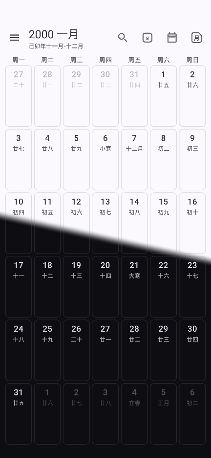
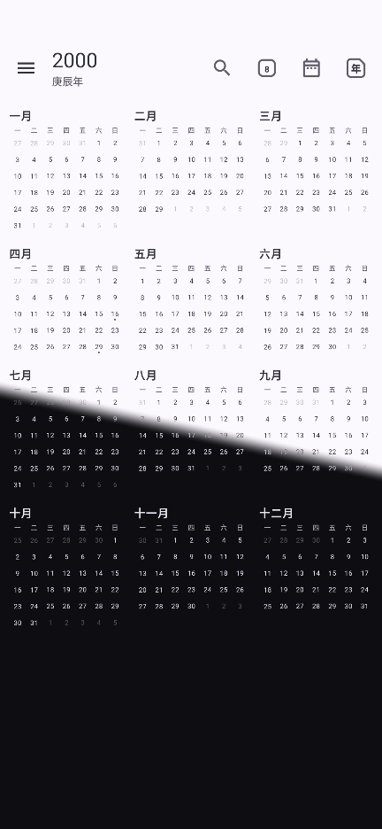

<h1>
  
  LunarCal
</h1>

  English | <a href="README.zh-CN.md">简体中文</a>

LunarCal is an Android calendar reminder app for Chinese lunar-calendar events.

The app is built with Kotlin and Jetpack Compose. It supports English and Simplified Chinese UI, light/dark themes, and a fully offline lunar calendar covering 1901-2100. LunarCal does not collect or transmit app data; event delivery and notifications rely on Android's local Calendar Provider.

  
  
  

## Features

- Swipeable month and year views with Gregorian dates and Chinese lunar labels.
- Create one-time, yearly, or monthly reminders based on Chinese lunar dates.
- Support reminders for per event with day/week offsets and a time picker.

## Calendar Data Source

This app uses Gregorian-lunar conversion data derived from the Hong Kong Observatory's public text tables.

- Source page: `https://www.hko.gov.hk/tc/gts/time/conversion1_text.htm`
- Yearly text files: `https://www.hko.gov.hk/tc/gts/time/calendar/text/files/TYYYYc.txt`
- Included generated asset: `app/src/main/assets/lunar/hko_lunar_1901_2100.csv`
- Supported date range: January 1, 1901 through December 31, 2100

The repository includes a converter script at `scripts/fetch_hko_lunar_data.py` and additional source notes in `docs/DATA_SOURCES.md`.

LunarCal is not affiliated with or endorsed by the Hong Kong Observatory. The data is bundled for offline calendar conversion and reminder scheduling.

## Assets

Generated source artwork for the launcher icon and drawer backgrounds is kept under `assets/source/`.

Android-ready compressed resources are generated into `app/src/main/res/` by `scripts/PrepareAssets.java`.
